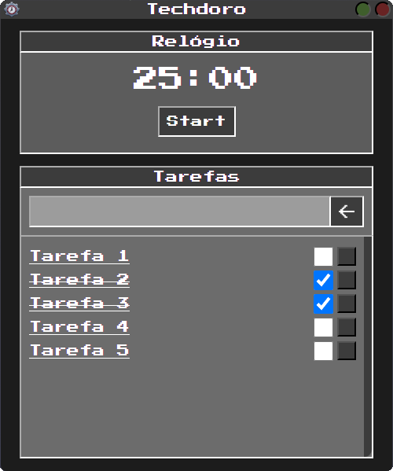

# Techdoro

Techdoro é uma aplicação de Pomodoro desenvolvida utilizando Electron. A técnica Pomodoro é uma metodologia de gerenciamento de tempo que ajuda a aumentar a produtividade, dividindo o trabalho em intervalos de tempo, geralmente de 25 minutos, separados por breves intervalos.

  

## Funcionalidades

- Temporizador Pomodoro personalizável
- Notificações de início e fim de intervalo
- Interface amigável e intuitiva
- Suporte multiplataforma

## Tecnologias Utilizadas

- Electron
- HTML/CSS
- JavaScript

## Como Usar

1. Clone o repositório
2. Instale as dependências com `npm install`
3. Inicie a aplicação com `npm start`

Aproveite e aumente sua produtividade com Techdoro!