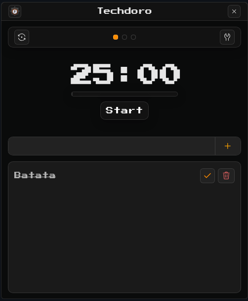

# Techdoro

<p align="center">
  
</p>

Como buildar o projeto

```bash
npm run make
```

Dessa forma você irá gerar os instaladores com base no sistema operacional que você está utilizando.
Porem dependendo do sistema operacional, pode ser que você precise de algumas dependências adicionais.

---

*Você só pode compilar o alvo RPM em máquinas Linux com os `rpm` pacotes `rpm-build` instalados.*

No Fedora você pode fazer algo assim:
```bash
sudo dnf install rpm-build
```

No Debian ou Ubuntu, você precisará fazer o seguinte:
```bash
sudo apt-get install rpm
```

>  O `MakerRpm` aplica um patch em `electron-installer-redhat` (veja `patches/electron-installer-redhat+3.4.0.patch`) para copiar o conteúdo a partir de `_topdir/BUILD/usr`, garantindo que o `%install` do spec encontre os arquivos empacotados. Após clonar o repositório, sempre rode `npm install` (ou `npm ci`) para garantir que o `patch-package` execute o patch antes de `npm run make:linux`.
</br>

*Você só pode compilar o pacote deb em máquinas Linux com os `fakeroot` pacotes `dpkg` instalados.*

No Debian ou Ubuntu, você pode fazer algo assim:
```bash
sudo apt-get install fakeroot dpkg
```

---

Você só pode compilar o alvo Squirrel.Windows em uma máquina Windows ou em uma máquina Linux com `mono` o pacote squirrel `wine` instalado.

---

[Download](https://github.com/Zelchi/Techdoro/releases/tag/v2.0.0)
